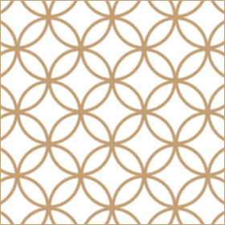
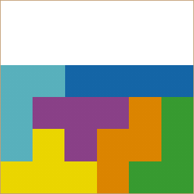
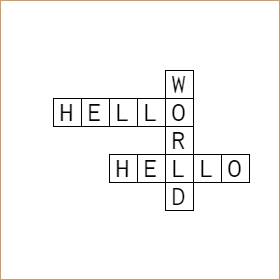
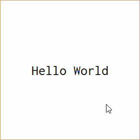
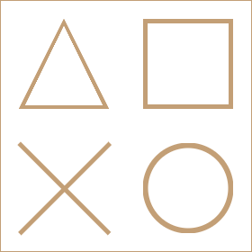

# CSS Gauntlet

*Do you have what it takes to run our CSS gauntlet?*

This gauntlet consists 10 challenges grouped by difficulty and will be used to assess your HTML and CSS knowledge of common as well as lesser known techniques. We encourage every participant to be as creative as possible in their solutions.

## Criteria

Participants will be judged with the following criteria:

- Completeness, or how far you've reached and how complete each level is.
- Efficiency, or how efficient your code is.
- Conformity, or how much of your code passes the [standard stylelint rules](https://github.com/stylelint/stylelint-config-standard) and how many browser does it support.
- Creativity, or how much unique and fun your code seems.

## Rules

1. You can edit the HTML and CSS as much as you want to achieve the desired results.
2. You cannot use any frameworks, including LESS, SCSS, SASS, etc.
3. You cannot use Javascript or any 3rd party or external libraries.
4. You cannot use SVGs or images.

## Instructions

1. [Fork the repository](https://docs.github.com/en/pull-requests/collaborating-with-pull-requests/working-with-forks/about-forks). DO NOT CREATE A BRANCH AND A PR.
2. Give access to the forked repository to the accounts mentioned in the email.
3. There are 10 challenges in total grouped by difficulty. You are to start with the level 1 challenges and make your way to level 4.
5. Each time you complete a challenge, you need to make a commit in the following format:
  
  ```
  [Level n: challenge-name]: Message
  ```
  
  Example: `[Level 1: Open sqaures]: Done.`
  
4. Make sure you push all your local changes to your repository.
5. Once done, include in your email a ZIP file containing your codes.

## Challenges

Each challenge will have an image or gif (for challenges where animation is required) that you'll need to replicate using HTML and CSS only. Your task is to replicate the image or animation as close as possible.

### Level 1

#### Open squares


#### Power icon


### Level 2

#### Circles pattern



#### Tetris



### Level 3

#### Crossword



#### Disappearing text



#### Rotating open square


#### Shapes



### Level 4

#### Rotating cogs


#### Stack overflow


